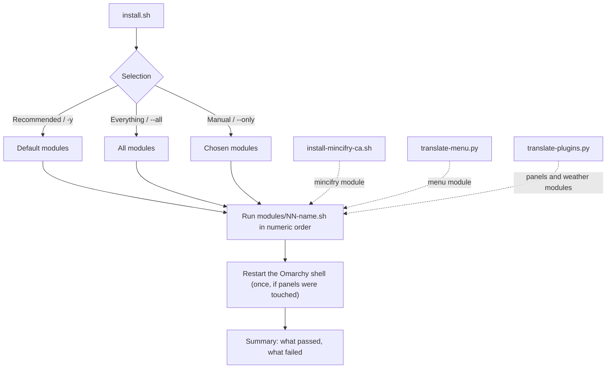
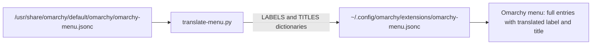
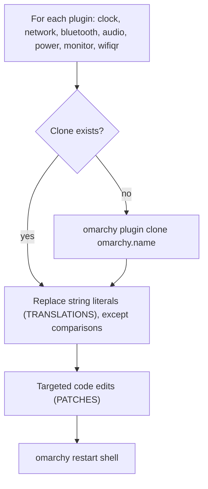
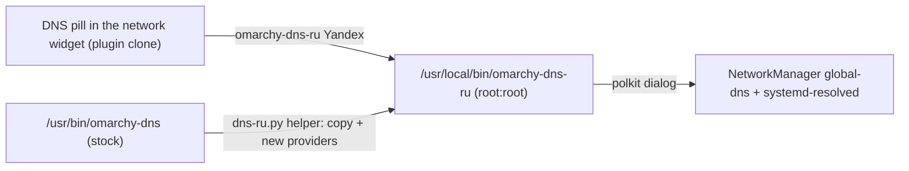
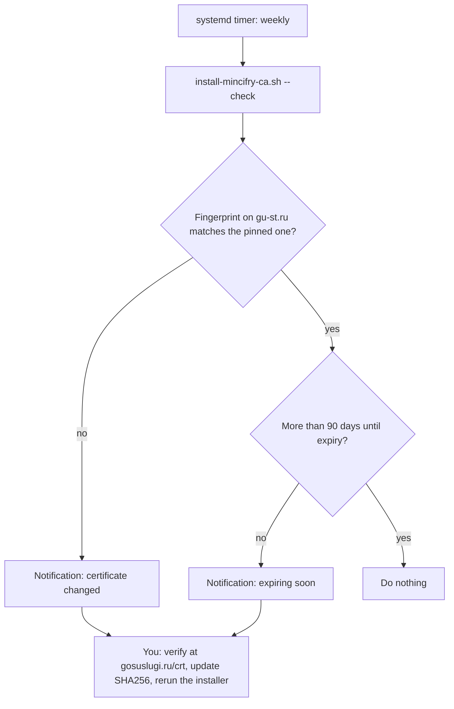
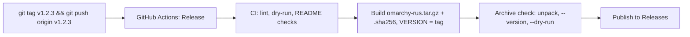

# omarchy-rus

🌐 [Русский](README.md) · **English**

Russian localization for Omarchy (Arch + Hyprland): locale, UI translation, keyboard layout, speech input, Russian Ministry
root certificates and other Russia-specific extras. Everything is a set of independent **modules**; when you run `install.sh`
you assemble a "basket" of the ones you want.

## Installation step by step
You need: Omarchy, a regular (non-root) user, a terminal and `sudo`.

1. **Download the archive** of the latest release: open the [releases page](https://github.com/chastnik/omarchy-rus/releases/latest)
   and click `omarchy-rus.tar.gz`. Or in one terminal command:
   ```bash
   curl -fLO https://github.com/chastnik/omarchy-rus/releases/latest/download/omarchy-rus.tar.gz
   ```
2. **Verify integrity** (optional). Download `omarchy-rus.tar.gz.sha256` next to it and run in the same folder:
   ```bash
   sha256sum -c omarchy-rus.tar.gz.sha256      # expected: omarchy-rus.tar.gz: OK
   ```
3. **Unpack and enter the folder:**
   ```bash
   tar xzf omarchy-rus.tar.gz && cd omarchy-rus
   ```
4. **See what the installer can do** (optional): `./install.sh --list`
5. **Run the installation:**
   ```bash
   ./install.sh
   ```
   Pick "Recommended", "Everything" or "Pick manually" (Space toggles, Enter continues). Enter your `sudo` password when asked.
6. **Log out and back in** so the interface language takes effect.

**Updating:** download the new release and repeat steps 1–5; the installer is idempotent. Installed archive version: `./install.sh --version`.
**Without a release (latest from the repository):** `git clone https://github.com/chastnik/omarchy-rus && cd omarchy-rus && ./install.sh`.

## Quick start
    ./install.sh                # interactive: "Recommended" / "Everything" / "Pick manually"
    ./install.sh --list         # module catalog with descriptions
    ./install.sh --all          # everything, including optional (e-signature, Ministry certificates)
    ./install.sh -y             # recommended only, no prompts
    ./install.sh --only timezone,telegram     # only the given ids (see --list)
    ./install.sh --skip voxtype,tts           # recommended, except the given ones
    ./install.sh --dry-run ...  # print what would run and exit

Selection UI: `gum` (ships with Omarchy; Space toggles, Ctrl+A selects all), with a plain text menu as fallback.
Modules that need `sudo` ask for the password once. A failing module does not stop the rest; a summary is printed at the end.
The Omarchy shell is restarted once at the end if panels were changed. Log out and back in afterwards.

## Modules
| id | Group | Default | What it does |
|----|-------|:---:|------------|
| `locale` | Base | ✓ | `ru_RU.UTF-8` locale, `LANG`, `us,ru` layout (Left Alt + Right Alt) |
| `hypr-layout` | Base | ✓ | `us,ru` in `~/.config/hypr/input.lua` (with backup), Hyprland reload |
| `spell` | Base | ✓ | `hunspell-ru`, `aspell-ru`, `man-pages-ru` |
| `timezone` | Simple | ✓ | timezone (`Europe/Moscow`, `RUS_TZ` variable) and `ru.pool.ntp.org` for timesyncd |
| `xcompose` | Simple | ✓ | block in `~/.XCompose`: `₽` `№` `«»` `—` `–` `…` (Compose = Caps Lock) |
| `vconsole-font` | Simple | ✓ | Cyrillic TTY font (`LatArCyrHeb-16`), takes effect after reboot |
| `office` | Simple | ✓ | LibreOffice: Russian pack, hyphenation, thesaurus (if LibreOffice is installed) |
| `telegram` | Apps | ✓ | `telegram-desktop` |
| `weather` | Apps | ✓ | weather widget: `unit=metric`, translation, Russian city geocoding |
| `dns` | Apps | ✓ | Russia-friendly DNS pills in the network widget (Yandex, DNS4EU, NextDNS) + root helper `omarchy-dns-ru` |
| `voxtype` | Apps | ✓ | Russian speech recognition (Parakeet), see below |
| `panels` | UI | ✓ | translates panels and overlays (plugin clones), see below |
| `menu` | UI | ✓ | translates the Omarchy menu |
| `keybindings` | UI | ✓ | Russian keybindings menu (Super+K): a copy of the stock one with translated descriptions |
| `fastfetch` | UI | ✓ | `~/.config/fastfetch/config.jsonc` with Russian headings ("About") |
| `tts` | UI | ✓ | `speech-dispatcher` + `espeak-ng`, Russian as the default language |
| `ecp` | Work | — | PC/SC for e-signatures: `pcsclite`, `ccid`, `opensc`, `pcsc-tools`, `pcscd` |
| `mincifry` | Work | — | Ministry certificates + weekly expiry check |



## Project layout
| File | Purpose |
|------|---------|
| `install.sh` | orchestrator: module selection, sudo, execution, summary |
| `modules/NN-name.sh` | modules; metadata in the header (`title`, `group`, `default`, `sudo`, `desc`). Drop your own file here to add one |
| `translate-menu.py` | translates the Omarchy menu |
| `.github/workflows/` | CI (`ci.yml`) and tag-triggered release build (`release.yml`) |
| `keybindings-ru.py` | Super+K menu translation and rebinding |
| `dns-ru.py` | root-helper generator and network widget patch for the `dns` module |
| `translate-plugins.py` | translates bar plugins; `./translate-plugins.py [name…] [--except name…]` |
| `install-mincifry-ca.sh` | Ministry certificates and expiry monitoring |
| `input.lua.snippet` | snippet appended to `~/.config/hypr/input.lua` |

## Deliberately not included
- **Russian pacman mirrors.** Omarchy uses its own "stable" mirror `stable-mirror.omarchy.org`, which pins package versions;
  replacing `mirrorlist` (e.g. via `reflector`) would break that model.
- **Screensaver and "About" text.** `about.txt`/`screensaver.txt` are ASCII logos; nothing to translate.
- **Lock screen and the polkit dialog.** Authentication plugins are not cloned: a bug in a clone could lock you out.
- **CryptoPro CSP, Rutoken/JaCarta drivers, 1C** are proprietary and need registration; the `ecp` module installs only the
  open part (PC/SC) and prints links.

## Notes
- Fonts (Noto, Liberation) already support Cyrillic; `fcitx5` is installed.
- Firefox: `omarchy pkg add firefox-i18n-ru`. Chromium and LibreOffice take their language from the system
  (LibreOffice may need a separate language pack).
- To keep the English UI but type in Russian, remove the `LANG` step.
- Files in `/usr/share/omarchy/` are never touched — only `~/.config/`.

## voxtype (voice input)
The `voxtype` module enables the ONNX build of voxtype (`sudo voxtype setup onnx --enable`), downloads
`parakeet-tdt-0.6b-v3-int8` (multilingual, Russian supported) and switches to `engine = "parakeet"` only after a
successful download.
Known issue: `models.voxtype.io` can serve the ~650 MB file very slowly; on failure the script fetches the same files from the
Hugging Face mirror (`istupakov/parakeet-tdt-0.6b-v3-onnx`) with resume and sha256 verification.

### If voxtype returns empty text or English garbage
Check the microphone level: on some laptops `Internal Mic Boost` = 100% and `Capture` = 100% cause clipping (peak 32768).
The script sets Boost=1, Capture=60% (`amixer -c 0 ...`).
Diagnostics: `arecord -D default -f S16_LE -r 16000 -c 1 -d 5 t.wav && voxtype transcribe t.wav`.

## Omarchy menu translation (`translate-menu.py`)
Omarchy has no i18n, so the script reads the stock menu and writes overrides of `label`/`title` to
`~/.config/omarchy/extensions/omarchy-menu.jsonc`. Entries are written **in full**: Omarchy fills missing fields with empty
values when merging, so a partial override would wipe `action`/`icon`/`when`. The menu reloads when the file is saved.


An existing foreign file is backed up. Run `./translate-menu.py` (idempotent).
New entries added by later Omarchy versions stay in English until added to `LABELS`/`TITLES`.

## Keybindings menu (`keybindings`, `keybindings-ru.py`)
Binding descriptions live in Hyprland Lua configs under `/usr/share/omarchy/` (not editable), and `omarchy-menu-keybindings` shows
them as-is. The module builds `~/.local/bin/omarchy-menu-keybindings-ru` — a copy of the stock script with a translation step
(171 descriptions + rules for "workspace N" and the like), rebinds `SUPER + K` in `~/.config/hypr/bindings.lua` (a block between
`omarchy-rus: keybindings` markers) and points the "Learn → Keybindings" menu entry to it.
Translation runs after sorting, so the list order stays stock; the list cache accounts for the dictionary hash.
If the stock script changes structure, the generator stops with a message and breaks nothing (`./install.sh --only keybindings` after
`omarchy update`). Untranslated descriptions stay in English; the Tmux and Herdr menus (`Super+Alt+K`, `Super+Ctrl+K`) are not translated.
The dictionary is `TRANSLATIONS` at the top of `keybindings-ru.py`.

## Bar panel translation (`translate-plugins.py`)
The translated QML plugins are: calendar (clock), network/Wi-Fi, Bluetooth, audio, power, display, Wi-Fi QR, Speed Test and disk test,
Tailscale, notifications, reminders, clipboard, emojis, image picker; weather is a separate `weather` module.
For each plugin the script:
1. clones it (`omarchy plugin clone`; clones live in `~/.config/omarchy/plugins/<user>.<name>`, are listed as "My …",
   and the originals get disabled);
2. replaces exact string literals from the `TRANSLATIONS` dictionary. Literals in comparisons
   (`===`, `indexOf(`, etc.) and internal keys (DHCP/Custom…) are left alone;
3. applies targeted code edits from `PATCHES` where text is not a literal: the calendar is formatted with the Russian
   locale explicitly (`Qt.locale("ru_RU")`; the plugin forces English by default), and power profile names
   ("Экономия/Баланс/Мощность") are built from system names;
4. restarts the shell (`omarchy restart shell`; without it open panels keep the old code; the bar disappears for a few seconds).



The script is idempotent. If a `PATCHES` fragment is not found (the plugin changed upstream), it writes a message to stderr.
**Downside of clones:** they do not receive upstream plugin updates. After `omarchy update`, if a panel breaks or you want the
fresh version: `rm -r ~/.config/omarchy/plugins/$USER.<name>` and run `./translate-plugins.py`
(to get the original back: `omarchy plugin enable omarchy.<name>`).
Not translated: Dropbox, Agents, bar widgets (indicators etc.), emoji names, lock screen and polkit (see "Deliberately not included").
Add new plugins to `TRANSLATIONS` the same way.

## DNS in the network widget (`dns`, `dns-ru.py`)
The stock pills are Cloudflare and Google, and `omarchy-dns` accepts only those (+ DHCP/Custom) and lives in `/usr/share/omarchy/`.
The module replaces them with **Yandex, DNS4EU, NextDNS** (+ DHCP and Custom). The idea and provider set were borrowed from
[WokoFlipper/omarchy-network-ru](https://github.com/WokoFlipper/omarchy-network-ru); the implementation is our own: no copy of the
whole plugin, only the network widget clone is patched.



- `dns-ru.py helper` generates `omarchy-dns-ru` from the stock script (all mechanics — NetworkManager, resolved, opportunistic DoT —
  stay stock), `dns-ru.py panel` patches the pills in the clone. The provider list is `PROVIDERS` at the top of `dns-ru.py`.
- The helper is installed **as root** (`root:root 0755`): a script that runs as root after confirmation must not be user-writable.
  Every DNS change asks for confirmation through polkit; there is no silent mode.
- If the stock `omarchy-dns` changes structure, the generator stops with a message instead of emitting a broken helper.
  After `omarchy update` rerun the module: `./install.sh --only dns`.
- The servers answered over IPv4 (UDP/53) at the time of writing. Reachability depends on your ISP — check on your side.
  Removal: `sudo rm /usr/local/bin/omarchy-dns-ru` and recreate the network clone (`rm -r ~/.config/omarchy/plugins/$USER.network`, `./translate-plugins.py network`).

## Russian Ministry root certificates (`install-mincifry-ca.sh`)
Needed for Russian government sites and some banks. The script downloads Russian Trusted Root/Sub CA from gu-st.ru, checks
pinned SHA-256 fingerprints (aborts on mismatch) and installs them into the system store (`update-ca-trust`, needs sudo),
the Chromium-family NSS database (`~/.pki/nssdb`), and enables `security.enterprise_roots.enabled` in Firefox profiles.
Restart browsers afterwards.

| Command | Action |
|---------|--------|
| `./install-mincifry-ca.sh` | install (idempotent) |
| `./install-mincifry-ca.sh --remove` | remove from all stores |
| `./install-mincifry-ca.sh --check` | no-sudo check: fingerprints on gu-st.ru and expiry (< 90 days warns) |
| `./install-mincifry-ca.sh --enable-timer` / `--disable-timer` | weekly automatic check (systemd user timer `mincifry-ca-check.timer`) |



There is **deliberately no automatic installation** of new certificates: this is trust in a root authority, so on a fingerprint
change or expiry < 90 days you get a notification and the decision is yours: verify at gosuslugi.ru/crt, update the
`SHA256` values in the script and run it. Expiry: Sub CA 2027-03-06, Root CA 2032-02-27.
Kept separate from `install.sh` on purpose.

## How to cut a release (for the maintainer)

1. Make sure `main` is green and your changes are committed and pushed.
2. Create a `vX.Y.Z` tag and push it: `git tag v1.0.0 && git push origin v1.0.0`.
3. Open the **Actions** tab: the **Release** workflow runs CI, builds the archive and publishes a release with `omarchy-rus.tar.gz`
   and `omarchy-rus.tar.gz.sha256` plus auto-generated notes.
4. Dry run without publishing: Actions → Release → **Run workflow** (the archive lands in the run's artifacts, no release is created).
5. A bad release: delete it on the releases page and delete the tag (`git push --delete origin v1.0.0`), then retry with a new tag.

## License
MIT, see [LICENSE](LICENSE).
