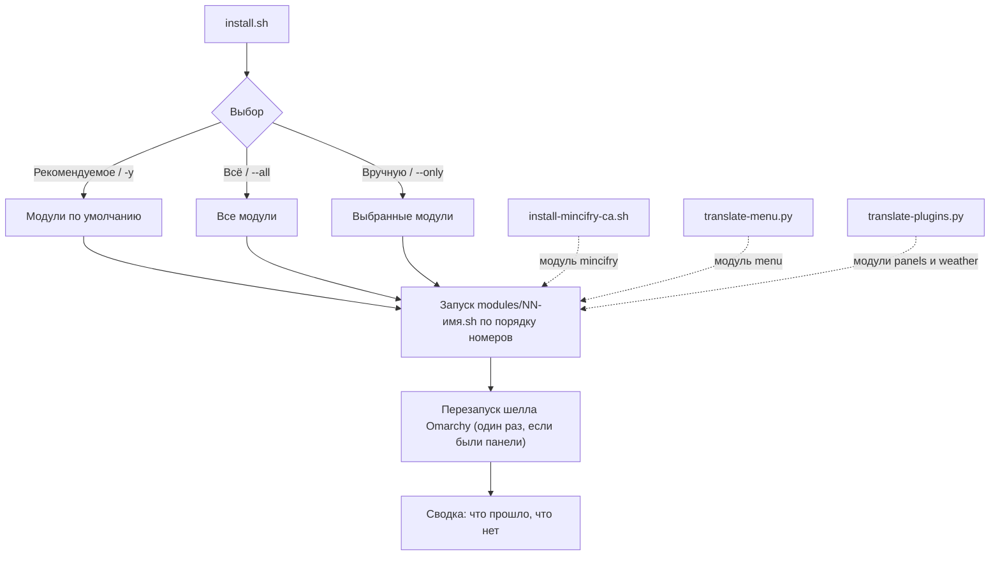
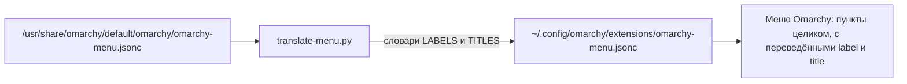
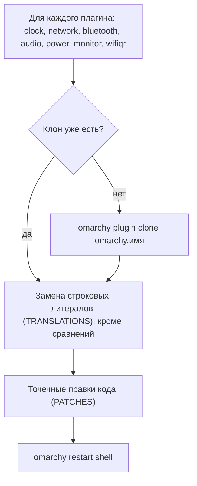
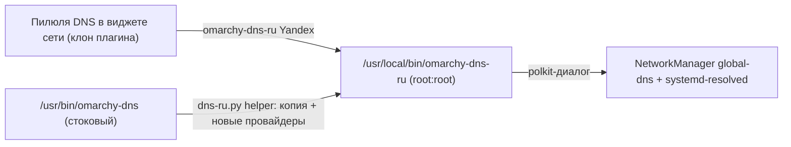
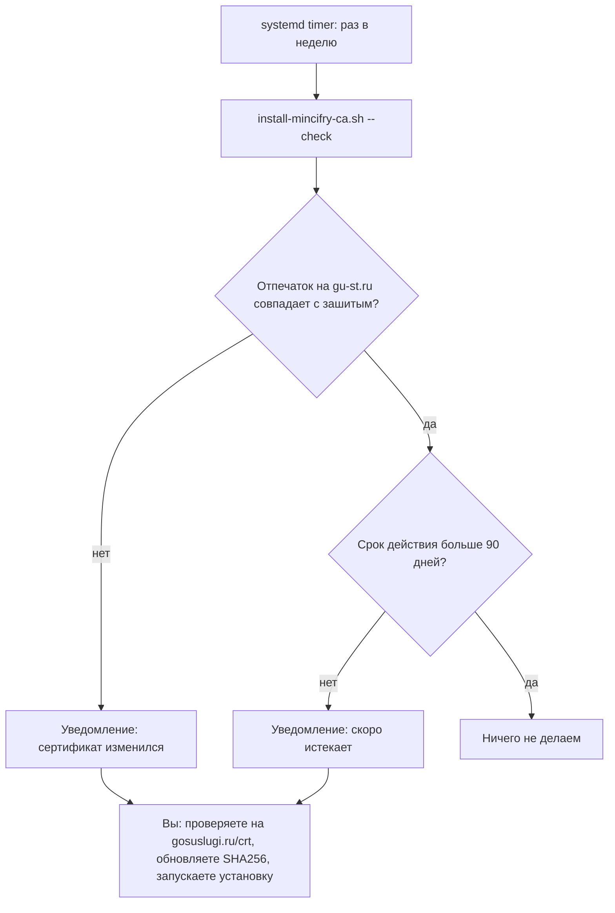
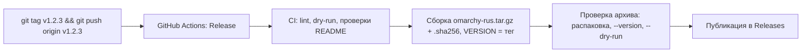

# omarchy-rus

🌐 **Русский** · [English](README.en.md)

Русификация Omarchy (Arch + Hyprland): локаль, интерфейс, раскладка, речь, сертификаты Минцифры и прочие «русские» мелочи.
Всё устроено как набор независимых **модулей**; при запуске `install.sh` вы собираете «корзину» из нужных.

## Установка по шагам
Нужно: Omarchy, обычный пользователь (не root), терминал и `sudo`.

1. **Скачайте архив** последнего релиза: откройте [страницу релизов](https://github.com/chastnik/omarchy-rus/releases/latest)
   и нажмите `omarchy-rus.tar.gz`. Либо одной командой в терминале:
   ```bash
   curl -fLO https://github.com/chastnik/omarchy-rus/releases/latest/download/omarchy-rus.tar.gz
   ```
2. **Проверьте целостность** (по желанию). Скачайте рядом `omarchy-rus.tar.gz.sha256` и выполните в той же папке:
   ```bash
   sha256sum -c omarchy-rus.tar.gz.sha256      # должно быть: omarchy-rus.tar.gz: ЦЕЛ (OK)
   ```
3. **Распакуйте и перейдите в папку:**
   ```bash
   tar xzf omarchy-rus.tar.gz && cd omarchy-rus
   ```
4. **Посмотрите, что умеет установщик** (по желанию): `./install.sh --list`
5. **Запустите установку:**
   ```bash
   ./install.sh
   ```
   Выберите «Рекомендуемое», «Всё» или «Выбрать вручную» (Пробел — отметить, Enter — продолжить). Введите пароль `sudo`, когда спросят.
6. **Перезайдите в сессию** (выйдите и войдите снова), чтобы применился язык интерфейса.

**Обновление:** скачайте новый релиз и повторите шаги 1–5; установщик идемпотентен. Версия установленного архива: `./install.sh --version`.
**Без релиза (последняя версия из репозитория):** `git clone https://github.com/chastnik/omarchy-rus && cd omarchy-rus && ./install.sh`.

## Быстрый старт
    ./install.sh                # интерактивный выбор: «Рекомендуемое» / «Всё» / «Выбрать вручную»
    ./install.sh --list         # каталог модулей с описаниями
    ./install.sh --all          # всё, включая необязательное (ЭЦП, сертификаты Минцифры)
    ./install.sh -y             # только рекомендуемое, без вопросов
    ./install.sh --only timezone,telegram     # только указанные (id из --list)
    ./install.sh --skip voxtype,tts           # рекомендуемое, кроме указанных
    ./install.sh --dry-run ...  # показать, что будет выполнено, и выйти

Интерфейс выбора: `gum` (есть в Omarchy; Пробел — отметить, Ctrl+A — выбрать всё), без него — текстовое меню.
Модули, которым нужен `sudo`, запрашивают пароль один раз. Сбой одного модуля не останавливает остальные;
в конце выводится сводка. Шелл Omarchy перезапускается один раз в конце, если менялись панели.
После установки перезайдите в сессию.

## Модули
| id | Группа | По умолч. | Что делает |
|----|--------|:---:|------------|
| `locale` | Базовая | ✓ | локаль `ru_RU.UTF-8`, `LANG`, раскладка `us,ru` (Left Alt + Right Alt) |
| `hypr-layout` | Базовая | ✓ | `us,ru` в `~/.config/hypr/input.lua` (с бэкапом), перезагрузка Hyprland |
| `spell` | Базовая | ✓ | `hunspell-ru`, `aspell-ru`, `man-pages-ru` |
| `timezone` | Простое | ✓ | часовой пояс (`Europe/Moscow`, переменная `RUS_TZ`) и `ru.pool.ntp.org` для timesyncd |
| `xcompose` | Простое | ✓ | блок в `~/.XCompose`: `₽` `№` `«»` `—` `–` `…` (Compose = Caps Lock) |
| `vconsole-font` | Простое | ✓ | кириллический шрифт TTY (`LatArCyrHeb-16`), действует после перезагрузки |
| `office` | Простое | ✓ | LibreOffice: русский пакет, переносы, тезаурус (если LibreOffice установлен) |
| `telegram` | Приложения | ✓ | `telegram-desktop` |
| `weather` | Приложения | ✓ | виджет погоды: `unit=metric`, перевод, геокодинг городов на русском |
| `dns` | Приложения | ✓ | пилюли DNS для России в виджете сети (Yandex, DNS4EU, NextDNS) + root-helper `omarchy-dns-ru` |
| `voxtype` | Приложения | ✓ | русское распознавание речи (Parakeet), см. ниже |
| `panels` | Интерфейс | ✓ | перевод панелей и оверлеев (клоны плагинов), см. ниже |
| `menu` | Интерфейс | ✓ | перевод меню Omarchy |
| `fastfetch` | Интерфейс | ✓ | `~/.config/fastfetch/config.jsonc` с русскими заголовками («О системе») |
| `tts` | Интерфейс | ✓ | `speech-dispatcher` + `espeak-ng`, язык по умолчанию — русский |
| `ecp` | Работа | — | PC/SC для ЭЦП: `pcsclite`, `ccid`, `opensc`, `pcsc-tools`, `pcscd` |
| `mincifry` | Работа | — | сертификаты Минцифры + еженедельная автопроверка срока |



## Структура проекта
| Файл | Назначение |
|------|------------|
| `install.sh` | оркестратор: выбор модулей, sudo, запуск, сводка |
| `modules/NN-имя.sh` | модули; метаданные в шапке (`title`, `group`, `default`, `sudo`, `desc`). Чтобы добавить свой — положите файл сюда |
| `translate-menu.py` | перевод меню Omarchy |
| `.github/workflows/` | CI (`ci.yml`) и сборка релиза по тегу (`release.yml`) |
| `dns-ru.py` | генератор root-helper и правка виджета сети для модуля `dns` |
| `translate-plugins.py` | перевод плагинов бара; `./translate-plugins.py [имя…] [--except имя…]` |
| `install-mincifry-ca.sh` | сертификаты Минцифры и мониторинг срока |
| `input.lua.snippet` | фрагмент для `~/.config/hypr/input.lua` |

## Чего здесь нет намеренно
- **Российские зеркала pacman.** Omarchy использует собственное «стабильное» зеркало `stable-mirror.omarchy.org`,
  которое фиксирует версии пакетов; замена `mirrorlist` (например, через `reflector`) сломала бы эту модель.
- **Заставка и «About».** `about.txt`/`screensaver.txt` — это ASCII-логотип, переводить нечего.
- **Экран блокировки и polkit-окно.** Плагины аутентификации не клонируются: ошибка в клоне может оставить без входа.
- **КриптоПро CSP, драйверы Рутокен/JaCarta, 1С** — проприетарные, требуют регистрации; модуль `ecp` ставит только
  открытую часть (PC/SC) и печатает ссылки.

## Заметки
- Шрифты (Noto, Liberation) уже поддерживают кириллицу; `fcitx5` установлен.
- Firefox: `omarchy pkg add firefox-i18n-ru`. Chromium и LibreOffice берут язык из системы
  (для LibreOffice может понадобиться отдельный language pack).
- Чтобы оставить английский интерфейс, но печатать по-русски, уберите шаг с `LANG`.
- Файлы Omarchy в `/usr/share/omarchy/` не трогаем — только `~/.config/`.

## voxtype (голосовой ввод)
Модуль `voxtype` включает ONNX-сборку voxtype (`sudo voxtype setup onnx --enable`), скачивает
`parakeet-tdt-0.6b-v3-int8` (мультиязычная, русский поддерживается) и только после успешной
загрузки переключает `engine = "parakeet"`.
Известная проблема: `models.voxtype.io` может отдавать файл (~650 МБ) очень медленно;
при неудаче скрипт качает те же файлы с зеркала Hugging Face (`istupakov/parakeet-tdt-0.6b-v3-onnx`) с докачкой и проверкой sha256.

### Если voxtype выдаёт пустой текст или английский мусор
Проверьте уровень микрофона: на некоторых ноутбуках `Internal Mic Boost` = 100% и `Capture` = 100%
дают клиппинг (peak 32768). Скрипт ставит Boost=1, Capture=60% (`amixer -c 0 ...`).
Диагностика: `arecord -D default -f S16_LE -r 16000 -c 1 -d 5 t.wav && voxtype transcribe t.wav`.

## Перевод меню Omarchy (`translate-menu.py`)
В Omarchy нет i18n, поэтому скрипт читает стандартное меню и пишет в
`~/.config/omarchy/extensions/omarchy-menu.jsonc` только переопределения `label`/`title`
(пункты записываются целиком: иначе Omarchy затирает action/icon/when; меню перечитывается при сохранении).

Существующий чужой файл бэкапится. Запуск: `./translate-menu.py` (идемпотентен).
Новые пункты после `omarchy update` остаются английскими, пока не добавлены в словари `LABELS`/`TITLES`.

## Перевод панелей бара (`translate-plugins.py`)
Переводятся QML-плагины: календарь (clock), сеть/Wi-Fi, Bluetooth, звук, питание, экран, Wi-Fi QR, Speed Test и тест диска,
Tailscale, уведомления, напоминания, буфер обмена, эмодзи, выбор изображений; погода — отдельным модулем `weather`.
Скрипт для каждого плагина:
1. клонирует его (`omarchy plugin clone`; клоны `~/.config/omarchy/plugins/<user>.<имя>`, в списке
   плагинов называются «My …», оригиналы отключаются);
2. заменяет точные строковые литералы по словарю `TRANSLATIONS`. Литералы в сравнениях
   (`===`, `indexOf(` и т.п.) и внутренние ключи (DHCP/Custom…) не трогаются;
3. применяет точечные правки кода `PATCHES`, где текст не литерал: календарь форматируется
   русской локалью явно (`Qt.locale("ru_RU")`; плагин по умолчанию принудительно английский), названия профилей
   питания («Экономия/Баланс/Мощность») собираются из системных имён;
4. перезапускает шелл (`omarchy restart shell`; без этого открытые панели держат старый код, бар на пару секунд пропадёт).



Запуск идемпотентен. Если фрагмент для `PATCHES` не найден (плагин изменился), скрипт пишет в stderr.
**Минус клонов:** они не получают обновления оригинальных плагинов. После `omarchy update`, если панель
сломалась или хочется свежей версии: `rm -r ~/.config/omarchy/plugins/$USER.<имя>` и `./translate-plugins.py`
(вернуть оригинал: `omarchy plugin enable omarchy.<имя>`).
Не переведены: Dropbox, Agents, виджеты бара (индикаторы и др.), названия эмодзи, экран блокировки и polkit (см. «Чего здесь нет намеренно»).
Новые плагины добавляются в `TRANSLATIONS` по тому же принципу.

## DNS в виджете сети (`dns`, `dns-ru.py`)
Стоковые пилюли — Cloudflare и Google, а `omarchy-dns` принимает только их (+ DHCP/Custom) и лежит в `/usr/share/omarchy/`.
Модуль заменяет их на **Yandex, DNS4EU, NextDNS** (+ DHCP и Custom). Идея и набор провайдеров подсмотрены в
[WokoFlipper/omarchy-network-ru](https://github.com/WokoFlipper/omarchy-network-ru); реализация своя: без копии всего плагина,
правится только клон виджета сети.



- `dns-ru.py helper` генерирует `omarchy-dns-ru` из стокового скрипта (все механики — NetworkManager, resolved, DoT opportunistic —
  остаются стоковыми), `dns-ru.py panel` правит пилюли в клоне. Список провайдеров — в `PROVIDERS` в начале `dns-ru.py`.
- Helper ставится **от root** (`root:root 0755`): скрипт, который исполняется от root после подтверждения, не должен быть
  доступен на запись пользователю. Каждая смена DNS запрашивает подтверждение через polkit, тихого режима нет.
- Если у стокового `omarchy-dns` изменится структура, генератор остановится с сообщением, а не выдаст битый helper.
  После `omarchy update` перезапустите модуль: `./install.sh --only dns`.
- Серверы на момент написания отвечали по IPv4 (UDP/53). Доступность зависит от провайдера связи — проверяйте у себя.
  Удаление: `sudo rm /usr/local/bin/omarchy-dns-ru` и пересоздайте клон сети (`rm -r ~/.config/omarchy/plugins/$USER.network`, `./translate-plugins.py network`).

## Сертификаты Минцифры (`install-mincifry-ca.sh`)
Нужны для госсайтов и части банков. Скрипт скачивает Russian Trusted Root/Sub CA с gu-st.ru, сверяет
зафиксированные SHA-256 (при несовпадении прерывается) и ставит их в системное хранилище
(`update-ca-trust`, нужен sudo), в NSS-базу Chromium-браузеров (`~/.pki/nssdb`) и включает
`security.enterprise_roots.enabled` в профилях Firefox. После установки перезапустите браузеры.

| Команда | Действие |
|---------|----------|
| `./install-mincifry-ca.sh` | установка (идемпотентна) |
| `./install-mincifry-ca.sh --remove` | удаление из всех хранилищ |
| `./install-mincifry-ca.sh --check` | проверка без sudo: отпечатки на gu-st.ru и срок действия (< 90 дней — предупреждение) |
| `./install-mincifry-ca.sh --enable-timer` / `--disable-timer` | еженедельная автопроверка (systemd user timer `mincifry-ca-check.timer`) |



Автоустановки новых сертификатов **нет намеренно**: это доверие к корневому центру, поэтому при смене отпечатка
или сроке < 90 дней приходит уведомление, а решение принимаете вы: проверьте на gosuslugi.ru/crt, обновите
`SHA256` в скрипте и запустите его. Сроки: Sub CA до 2027-03-06, Root CA до 2032-02-27.
Отдельно от `install.sh` намеренно.

## Как выпустить релиз (для автора)

1. Убедитесь, что `main` зелёный и изменения закоммичены и выложены.
2. Создайте тег вида `vX.Y.Z` и отправьте его: `git tag v1.0.0 && git push origin v1.0.0`.
3. Откройте вкладку **Actions**: workflow **Release** прогонит CI, соберёт архив и опубликует релиз с файлами `omarchy-rus.tar.gz` и `omarchy-rus.tar.gz.sha256`
   и автоматическим списком изменений.
4. Проверка без публикации: Actions → Release → **Run workflow** (архив окажется в артефактах запуска, релиз не создаётся).
5. Ошибочный релиз: удалите его на странице релизов и тег (`git push --delete origin v1.0.0`), затем повторите с новым тегом.

## Лицензия
MIT, см. [LICENSE](LICENSE).
